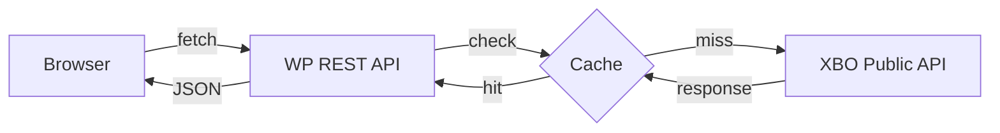
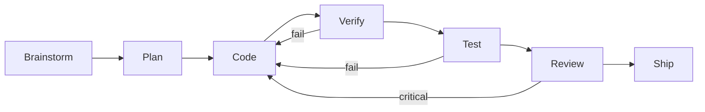

# README Update — Landing Page Generator

## Overview

Generate a visually impactful README.md for the GitHub repository. The README serves as a landing page with badges, metrics dashboard, feature status, architecture diagrams, and development timeline.

## Data Sources

Collect data from these sources before generating:

1. **Metrics:** Read `docs/metrics/tasks.json` for task stats
2. **Git history:** `git log --oneline | wc -l` for commit count
3. **Test results:** `cd wp-content/plugins/xbo-market-kit && composer run test 2>&1` for test count/status
4. **Feature status:** Inspect `includes/` directories for implemented classes
5. **Worklog:** Read latest `docs/worklog/*.md` for recent activity

## README Structure

Generate the following sections in order:

### 1. Hero Header
- Centered `<div align="center">`
- Project title as H1
- Subtitle: "WordPress Plugin for Live Crypto Market Data"
- Badges row 1 (tech): WordPress, PHP, License, Build Status
- Badges row 2 (project): Claude Code, Hackathon 2026, Stars
- One-liner tagline
- Navigation links

### 2. AI Development Stats
- HTML table with metric cards
- Metrics: Total Dev Time, Tasks Completed, Tokens Used, Test Pass Rate, Commits
- Use shields.io custom badges for each metric
- Data from `docs/metrics/tasks.json`

### 3. Features Table
- Table with columns: Widget, Description, Shortcode, Block, Elementor
- Status indicators: ✅ Done, 🔄 In Progress, ⬜ Planned
- Determine status by checking if corresponding PHP classes exist

### 4. Shortcode Examples
- Code blocks showing all available shortcodes with parameters

### 5. Architecture Diagram
- Mermaid flowchart: Browser → WP REST → Cache → XBO API
- Show data flow direction

### 6. AI Workflow Diagram
- Mermaid flowchart showing the development pipeline
- Brainstorm → Plan → Code → Verify → Test → Review → Ship

### 7. Development Timeline
- 7-day plan with Unicode progress bars
- Day N: `██████████░░░░` Description
- Calculate progress from worklog entries

### 8. Quick Start
- Prerequisites, clone, setup script
- Manual setup alternative

### 9. Documentation Links
- Table with links to plans, worklog, architecture, CLAUDE.md

### 10. Development Commands
- Composer scripts for phpcs, phpstan, test

### 11. Footer
- Centered, credits, links

## Badge Templates

```markdown


```

## Mermaid Diagram Templates

### Architecture:
````

````

### AI Workflow:
````

````

## Execution

1. Collect all data from sources listed above
2. Generate each section using the templates
3. Write to `README.md` at project root
4. Verify the file renders correctly (no broken markdown)
