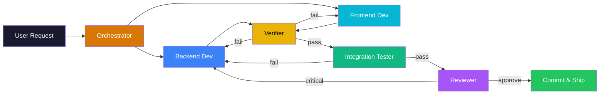
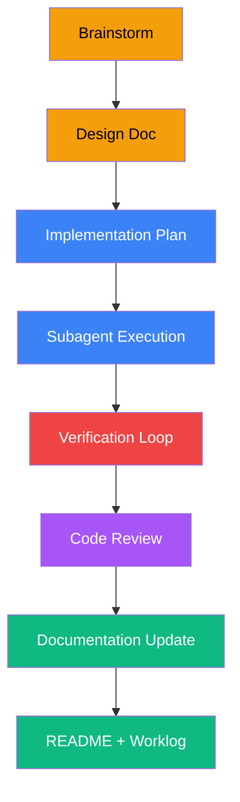
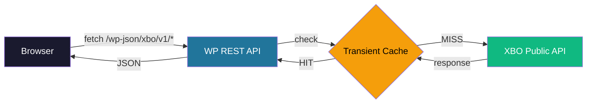

<div align="center">

<!-- HERO HEADER -->


# XBO Market Kit

### Real-Time Crypto Market Data for WordPress

[](https://wordpress.org/)
[](https://www.php.net/)
[](LICENSE)
[](https://phpstan.org/)

[-D97706?style=for-the-badge&logo=anthropic&logoColor=white)](https://claude.ai/)
[](https://github.com/atlantdak/claude-code-hackathon-xbo-market-kit)

**Live tickers, orderbooks, trade feeds & market analytics — delivered through Shortcodes, Gutenberg Blocks, and Elementor Widgets.**

*100% AI-developed: Every line of code, every test, every doc — written by Claude Code agents.*

---

[Features](#-features) &bull;
[AI Agents](#-ai-powered-development) &bull;
[Architecture](#-architecture) &bull;
[Quick Start](#-quick-start) &bull;
[Documentation](#-documentation)

</div>

---

## AI Development Dashboard

<div align="center">

<!-- Dynamic metrics — updated by /readme-update skill -->

|  |  |  |  |  |
|:---:|:---:|:---:|:---:|:---:|

</div>

---

## Features

<table>
<tr>
<th>Widget</th>
<th>Description</th>
<th>Shortcode</th>
<th>Block</th>
<th>Elementor</th>
</tr>
<tr>
<td><strong>Live Ticker</strong></td>
<td>Real-time prices for selected trading pairs with 24h change</td>
<td align="center">⬜</td>
<td align="center">⬜</td>
<td align="center">⬜</td>
</tr>
<tr>
<td><strong>Top Movers</strong></td>
<td>Biggest gainers and losers by 24h % change</td>
<td align="center">⬜</td>
<td align="center">⬜</td>
<td align="center">⬜</td>
</tr>
<tr>
<td><strong>Mini Orderbook</strong></td>
<td>Live bid/ask depth table with spread indicator</td>
<td align="center">⬜</td>
<td align="center">⬜</td>
<td align="center">⬜</td>
</tr>
<tr>
<td><strong>Recent Trades</strong></td>
<td>Trade feed with side, price, volume, timestamp</td>
<td align="center">⬜</td>
<td align="center">⬜</td>
<td align="center">⬜</td>
</tr>
<tr>
<td><strong>Slippage Calculator</strong></td>
<td>Estimate execution price from orderbook depth</td>
<td align="center">⬜</td>
<td align="center">⬜</td>
<td align="center">⬜</td>
</tr>
</table>

> **Legend:** ✅ Done &nbsp; 🔄 In Progress &nbsp; ⬜ Planned

### Shortcode Examples

```
[xbo_ticker symbols="BTC/USDT,ETH/USDT" refresh="15"]
[xbo_movers mode="gainers" limit="8"]
[xbo_orderbook symbol="BTC_USDT" depth="20" refresh="5"]
[xbo_trades symbol="BTC/USDT" limit="20" refresh="10"]
[xbo_slippage symbol="BTC_USDT" side="buy" amount="10000"]
```

---

## AI-Powered Development

This project demonstrates a **fully autonomous AI development workflow**. Five specialized Claude Code agents collaborate through an orchestration pipeline:



### Agent Roster

| Agent | Role | Model | Specialty |
|:------|:-----|:------|:----------|
| **Backend Dev** | PHP/WordPress | Opus 4.6 | API client, REST endpoints, caching, shortcodes |
| **Frontend Dev** | CSS/JS/Tailwind | Opus 4.6 | UI components, Gutenberg blocks, Elementor widgets |
| **Verifier** | Quality Gates | Haiku 4.5 | PHPCS, PHPStan (L6), PHPUnit |
| **Integration Tester** | Live Testing | Haiku 4.5 | WP-CLI page testing, browser verification |
| **Reviewer** | Code Review | Haiku 4.5 | Codex CLI review, security audit |

### Process Pipeline



### Skills & Automation

| Skill | Purpose |
|:------|:--------|
| `/orchestrate` | Full pipeline: brainstorm → plan → code → verify → review → ship |
| `/readme-update` | Regenerate this README with live metrics and status |
| `/worklog-update` | Add entries to the development journal |
| `/metrics` | Collect and display time/token/task analytics |

### Command Shortcuts

| Command | Purpose |
|:--------|:--------|
| `/feature "desc"` | Start full pipeline for a new feature |
| `/verify` | Run all quality checks (PHPCS + PHPStan + PHPUnit + Security) |
| `/test` | Quick PHPUnit test run |
| `/review` | Code review with Codex CLI |
| `/docs` | Update worklog + README + metrics in one command |
| `/status` | Show project status, features, and metrics |

---

## Architecture



**Key decisions:**
- **Server-side only** — All XBO API calls go through WordPress backend (no CORS)
- **Transient caching** — Per-endpoint TTL prevents rate limiting
- **One data core** — Shortcodes, Blocks, and Elementor widgets share the same services
- **Graceful degradation** — API failures show cached data or friendly error states

### WP REST Endpoints

| Route | Source | Cache TTL |
|:------|:-------|:----------|
| `GET /xbo/v1/ticker` | `/trading-pairs/stats` | 15-60s |
| `GET /xbo/v1/movers` | `/trading-pairs/stats` | 15-60s |
| `GET /xbo/v1/orderbook?symbol=` | `/orderbook/{symbol}` | 1-30s |
| `GET /xbo/v1/trades?symbol=` | `/trades` | 5-15s |
| `GET /xbo/v1/slippage?symbol=&side=&amount=` | `/orderbook/{symbol}` (calculated) | 1-30s |

### Project Structure

```
app/public/                             # Git root
├── .claude/plugins/xbo-ai-flow/        # AI workflow plugin
│   ├── agents/                         # 5 specialized agents
│   ├── skills/                         # 4 automation skills
│   ├── hooks/                          # Session hooks
│   └── scripts/                        # Metrics collection
├── docs/                               # Full documentation
│   ├── plans/                          # Design docs & plans
│   ├── worklog/                        # Development journal
│   ├── metrics/                        # Task analytics
│   └── architecture/                   # ADRs
├── wp-content/plugins/xbo-market-kit/  # The WordPress plugin
│   ├── includes/                       # PHP source (PSR-4)
│   │   ├── Api/                        # XBO API client
│   │   ├── Cache/                      # Caching layer
│   │   ├── Rest/                       # REST controllers
│   │   ├── Shortcodes/                 # Shortcode handlers
│   │   ├── Blocks/                     # Gutenberg blocks
│   │   ├── Elementor/                  # Elementor widgets
│   │   └── Admin/                      # Settings page
│   ├── assets/                         # CSS, JS
│   └── tests/                          # PHPUnit tests
└── CLAUDE.md                           # AI agent instructions
```

---

## Development Timeline

> **Hackathon:** 7 days, Feb 22–28, 2026

| Day | Focus | Progress |
|:----|:------|:---------|
| **Day 1** | Repo setup, plugin scaffold, AI workflow (full autonomy) | `████████████████████` 100% |
| **Day 2** | API client, caching, REST endpoints | `░░░░░░░░░░░░░░░░░░░░` 0% |
| **Day 3** | Shortcodes: ticker + movers | `░░░░░░░░░░░░░░░░░░░░` 0% |
| **Day 4** | Shortcodes: orderbook + trades | `░░░░░░░░░░░░░░░░░░░░` 0% |
| **Day 5** | Slippage calculator + UX polish | `░░░░░░░░░░░░░░░░░░░░` 0% |
| **Day 6** | Gutenberg blocks for all widgets | `░░░░░░░░░░░░░░░░░░░░` 0% |
| **Day 7** | Elementor widgets, demo, README polish | `░░░░░░░░░░░░░░░░░░░░` 0% |

---

## Quick Start

### Prerequisites

- [Local by Flywheel](https://localwp.com/) or any WordPress environment
- PHP 8.1+
- Composer
- WP-CLI (optional)

### Setup

```bash
# Clone the repository
git clone git@github.com:atlantdak/claude-code-hackathon-xbo-market-kit.git
cd claude-code-hackathon-xbo-market-kit/app/public

# Run setup script (downloads WP core + installs dependencies)
bash scripts/setup.sh

# Or manually:
# 1. Set up WordPress (wp core download, create wp-config, etc.)
# 2. cd wp-content/plugins/xbo-market-kit && composer install
# 3. Activate the plugin in WP Admin
```

### Development Commands

```bash
cd wp-content/plugins/xbo-market-kit

composer install          # Install dependencies
composer run phpcs        # Code style checks (WordPress standards)
composer run phpcbf       # Auto-fix code style
composer run phpstan      # Static analysis (level 6)
composer run test         # PHPUnit tests
```

---

## Documentation

| Document | Description |
|:---------|:------------|
| [Product Spec](docs/plans/2026-02-22-xbo-market-kit-spec.md) | Full product specification & API reference |
| [AI Workflow Design](docs/plans/2026-02-22-ai-workflow-design.md) | Agent architecture & orchestration design |
| [AI Workflow Plan](docs/plans/2026-02-22-ai-workflow-plan.md) | Implementation plan for AI infrastructure |
| [Project Setup Design](docs/plans/2026-02-22-project-setup-design.md) | Environment & repository decisions |
| [Work Log](docs/worklog/) | Daily development journal |
| [Metrics](docs/metrics/) | Task analytics (time, tokens, commits) |
| [Architecture](docs/architecture/) | Key technical decisions (ADRs) |
| [CLAUDE.md](CLAUDE.md) | Instructions for Claude Code agents |

---

## Demo Pages

| Page | Content |
|:-----|:--------|
| **Landing Showcase** | Hero + live ticker + top movers + CTA |
| **Trading Insights** | Orderbook + recent trades + slippage calculator |
| **Ops Status** | Currency availability + deposit/withdraw status |

---

## License

GPL-2.0-or-later

---

<div align="center">

**Built with [Claude Code](https://claude.ai/) (Opus 4.6) for the Claude Code Hackathon 2026**

*Every line of code, every test, every document — created by AI agents*

[](https://github.com/atlantdak/claude-code-hackathon-xbo-market-kit)
[](docs/)
[](docs/worklog/)

**Author:** [Dmytro Kishkin](mailto:atlantdak@gmail.com)

</div>
