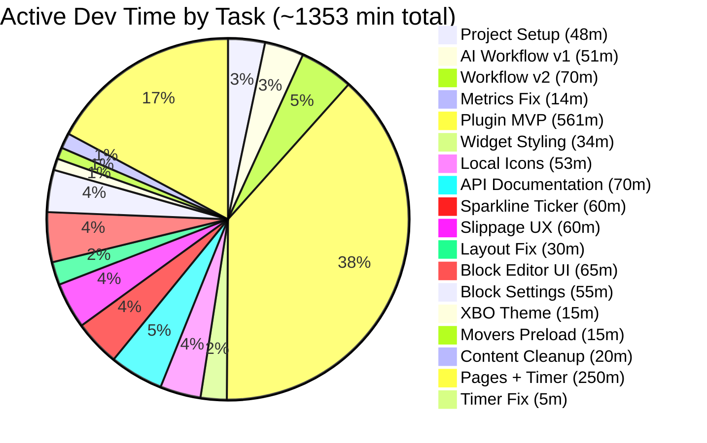
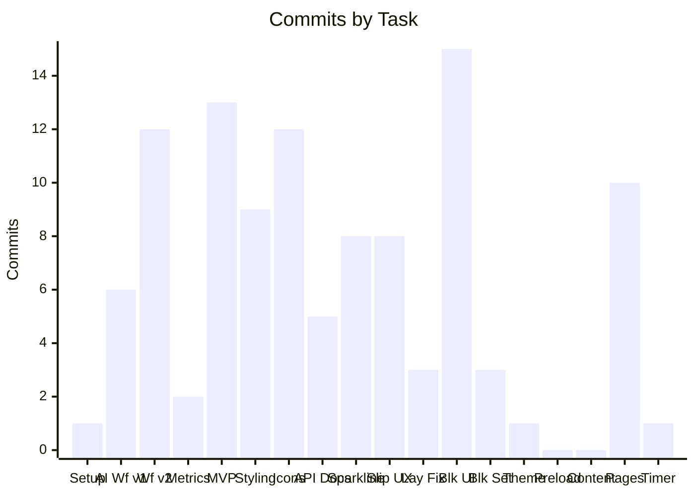
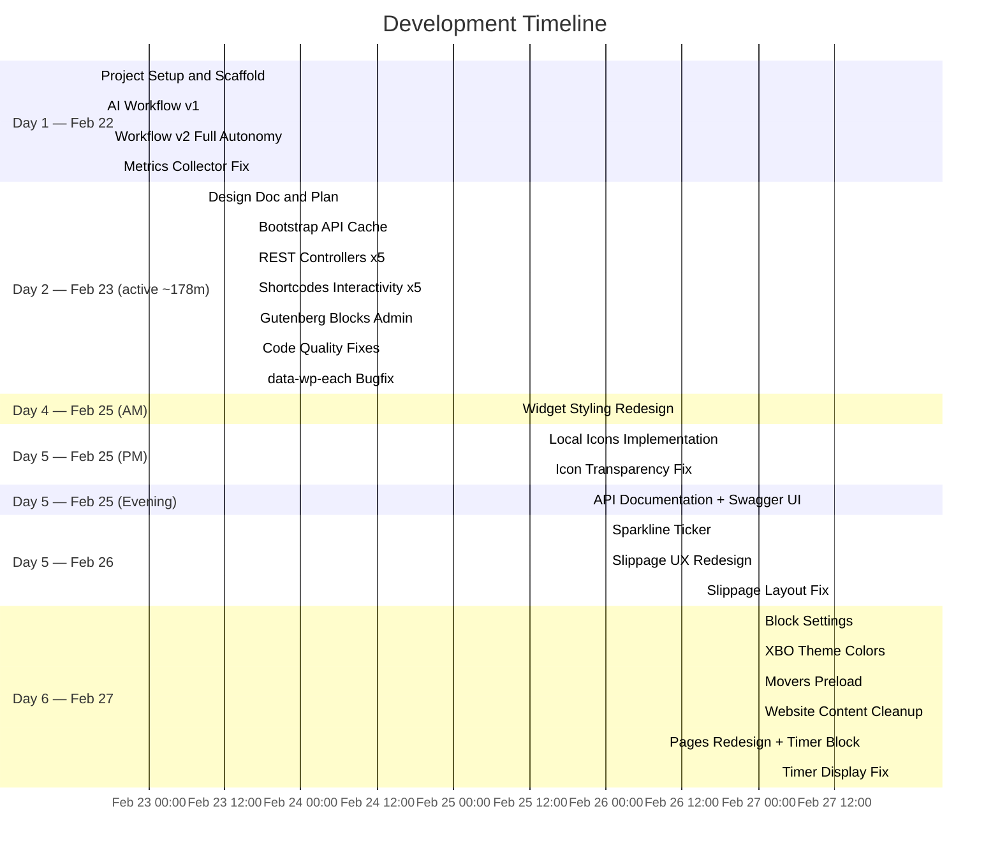
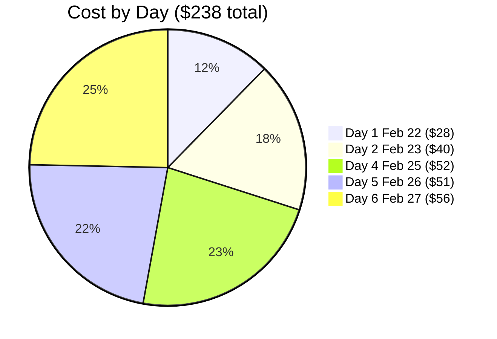

<div align="center">

<!-- HERO HEADER -->


# XBO Market Kit

### Real-Time Crypto Market Data for WordPress

[](https://wordpress.org/)
[](https://www.php.net/)
[](LICENSE)
[](https://phpstan.org/)

[](https://github.com/atlantdak/claude-code-hackathon-xbo-market-kit/releases/latest)

[-D97706?style=for-the-badge&logo=anthropic&logoColor=white)](https://claude.ai/)
[](https://github.com/atlantdak/claude-code-hackathon-xbo-market-kit)

**Live tickers, orderbooks, trade feeds & market analytics — delivered through Shortcodes, Gutenberg Blocks, and Elementor Widgets.**

*100% AI-developed: Every line of code, every test, every doc — written by Claude Code agents.*

---

[Dashboard](#ai-development-dashboard) &bull;
[Features](#features) &bull;
[Showcase](docs/SHOWCASE.md) &bull;
[AI Agents](#ai-powered-development) &bull;
[Architecture](#architecture) &bull;
[API Docs](https://atlantdak.github.io/claude-code-hackathon-xbo-market-kit/api/) &bull;
[Quick Start](#quick-start) &bull;
[Documentation](#documentation)

</div>

---

## AI Development Dashboard

<!-- Dynamic metrics — updated by /readme-update skill -->

<div align="center">
<table>
<tr>
<td align="center" width="130"><h2>~$238</h2><sub>Total Cost</sub></td>
<td align="center" width="130"><h2>~22h 33m</h2><sub>Active Time</sub></td>
<td align="center" width="130"><h2>18 / 18</h2><sub>Tasks Done</sub></td>
<td align="center" width="130"><h2>160</h2><sub>Commits</sub></td>
<td align="center" width="130"><h2>~473M</h2><sub>Tokens</sub></td>
<td align="center" width="130"><h2>51</h2><sub>Sessions</sub></td>
</tr>
</table>

> *Cost from [ccusage](https://github.com/ryoppippi/ccusage) billing data (Opus 4.6 $218 + Sonnet 4.6 $9 + Haiku 4.5 $5 + Sonnet 4.5 $1 + other $5). Active time excludes idle gaps > 5 min. Tracked by [xbo-ai-flow](/.claude/plugins/xbo-ai-flow/) plugin.*

</div>

### Time Allocation



### Commits per Task



### Timeline



### Cost Breakdown



> **Pricing source:** [ccusage](https://github.com/ryoppippi/ccusage) billing API — per-project, per-model breakdown. Opus 4.6 + Sonnet 4.6 + Sonnet 4.5 + Haiku 4.5. 51 sessions across 6 days.

### Task Details

| # | Task | Duration | Commits | Cost | Status |
|:-:|:-----|:--------:|:-------:|:----:|:------:|
| 1 | **Project Setup** — repo, scaffold, docs, CLAUDE.md, README | 48m | 1 | $7.28 |  |
| 2 | **AI Workflow v1** — 5 agents, 4 skills, hooks, metrics, MCP | 51m | 6 | $7.74 |  |
| 3 | **Workflow v2** — executable skills, TDD, security, commands, ADR | 70m | 12 | $10.62 |  |
| 4 | **Metrics Fix** — ccusage integration + visual dashboard | 14m | 2 | $2.12 |  |
| **5** | **Plugin MVP** — full implementation (5 phases, 11 sub-tasks) | **561m** | **13** | **$38.64** |  |
| 5.1 | &nbsp;&nbsp;↳ Plugin bootstrap, autoloader, activation hook | | | *Phase 1* |  |
| 5.2 | &nbsp;&nbsp;↳ ApiClient with error handling, timeouts, filterable base URL | | | *Phase 1* |  |
| 5.3 | &nbsp;&nbsp;↳ CacheManager with per-endpoint TTL via transients | | | *Phase 1* |  |
| 5.4 | &nbsp;&nbsp;↳ REST controllers: Ticker + Movers (stats-based) | | | *Phase 2* |  |
| 5.5 | &nbsp;&nbsp;↳ REST controllers: Orderbook + Trades + Slippage (symbol-based) | | | *Phase 2* |  |
| 5.6 | &nbsp;&nbsp;↳ Shortcodes: Ticker + Movers with Interactivity API | | | *Phase 3* |  |
| 5.7 | &nbsp;&nbsp;↳ Shortcodes: Orderbook + Trades with Interactivity API | | | *Phase 3* |  |
| 5.8 | &nbsp;&nbsp;↳ Shortcode: Slippage Calculator with debounced auto-calc | | | *Phase 3* |  |
| 5.9 | &nbsp;&nbsp;↳ 5 Gutenberg blocks (server-rendered via render.php) | | | *Phase 4* |  |
| 5.10 | &nbsp;&nbsp;↳ Admin settings page + demo page on activation | | | *Phase 4* |  |
| 5.11 | &nbsp;&nbsp;↳ Code quality (PHPCS/PHPStan/PHPUnit) + data-wp-each bugfix | | | *Phase 5* |  |
| 6 | **Widget Styling** — Tailwind → BEM + CSS Custom Properties, PostCSS pipeline | 34m | 9 | $11.23 |  |
| 7 | **Local Icons** — IconResolver, IconSync, WP-CLI, 205 SVGs, zero CDN dependency | 53m | 12 | $17.51 |  |
| 8 | **API Documentation** — OAS3 generation, Swagger UI, GitHub Pages | 70m | 5 | $23.13 |  |
| 8.1 | &nbsp;&nbsp;↳ Update production URL in OAS3 spec when deploying | | | |  |
| 9 | **Sparkline Ticker** — constrained random walk SVG generation, ring buffer live updates | 60m | 8 | $14.30 |  |
| 10 | **Slippage UX Redesign** — dropdown selectors, PairCatalog, context-based state | 60m | 8 | $14.30 |  |
| 11 | **Slippage Layout Fix** — 2-col CSS grid, reactive icon binding, field reorder | 30m | 3 | $7.15 |  |
| 12 | **Block Editor UI** — 20 sub-tasks, full Gutenberg editor controls, live preview | 65m | 15 | $15.49 |  |
| 13 | **Block Settings** — PairSelector/PairsSelector dropdowns, trading-pairs REST endpoint | 55m | 3 | $10.00 |  |
| 14 | **XBO Theme Colors** — Style variation for prime-fse with XBO brand palette | ~15m | 1 | $2.73 |  |
| 15 | **Movers Preload** — Server-side data fetch, static SSR rows, zero-flash hydration ([#25](https://github.com/atlantdak/claude-code-hackathon-xbo-market-kit/issues/25)) | ~15m | — | $2.73 |  |
| 16 | **Website Content Cleanup** — Replace Lorem Ipsum, update contacts, site settings ([#26](https://github.com/atlantdak/claude-code-hackathon-xbo-market-kit/issues/26)) | ~20m | — | $2.73 |  |
| **17** | **Pages Redesign + Timer Block** — 9 pages with gradient + glassmorphism, Refresh Timer block with auto-sync, 6 block patterns, 15 unit tests | **250m** | **10** | **$35.00** |  |
| 18 | **Timer Display Fix** — CSS Grid overlay for digit vertical centering in circle ([#27](https://github.com/atlantdak/claude-code-hackathon-xbo-market-kit/issues/27)) | ~5m | 1 | $3.00 |  |
| 19 | **Slippage Defaults** — default amount=1, always-visible results with em dash placeholders, field height alignment | ~30m | 5 | — |  |

> **Duration = active session time** (idle gaps > 5 min excluded). Wall clock span was significantly longer — see details below.

<details>
<summary><strong>Wall Clock vs Active Time</strong></summary>

| Day | Tasks | Wall Clock | Active Time | Idle/Pauses | Sessions |
|:----|:------|:----------:|:-----------:|:-----------:|:--------:|
| Feb 22 | Tasks 1–4 | 24h 50m | 3h 56m | 20h 54m | 4 |
| Feb 23 | Task 5 (Plugin MVP) | 8h 43m | 3h 5m | 5h 38m | 9 |
| Feb 25 | Tasks 6–10 | 36h 1m | 7h 16m | 28h 45m | 17 |
| Feb 26 | Tasks 11–12 | 11h 3m | 3h 32m | 7h 31m | 17 |
| Feb 27 | Tasks 13–18 | ~7h 0m | ~5h 40m | ~1h 20m | 4 |
| **Total** | **All 18 tasks** | **~87h 50m** | **~22h 33m** | **~65h** | **51** |

Active time = continuous Claude Code processing with no gap > 5 min between API calls. Source: `docs/metrics/sessions.json`.

</details>

---

## Features

<table>
<tr>
<th>Widget</th>
<th>Description</th>
<th>Shortcode</th>
<th>Block</th>
<th>Elementor</th>
</tr>
<tr>
<td><strong>Live Ticker</strong></td>
<td>Real-time prices for selected trading pairs with 24h change + sparklines</td>
<td align="center">✅</td>
<td align="center">✅</td>
<td align="center">⬜</td>
</tr>
<tr>
<td><strong>Top Movers</strong></td>
<td>Biggest gainers and losers by 24h % change with tab switching</td>
<td align="center">✅</td>
<td align="center">✅</td>
<td align="center">⬜</td>
</tr>
<tr>
<td><strong>Mini Orderbook</strong></td>
<td>Live bid/ask depth table with depth bars and spread indicator</td>
<td align="center">✅</td>
<td align="center">✅</td>
<td align="center">⬜</td>
</tr>
<tr>
<td><strong>Recent Trades</strong></td>
<td>Trade feed with color-coded side, price, volume, timestamp</td>
<td align="center">✅</td>
<td align="center">✅</td>
<td align="center">⬜</td>
</tr>
<tr>
<td><strong>Slippage Calculator</strong></td>
<td>Avg execution price, slippage %, spread, total cost from orderbook depth</td>
<td align="center">✅</td>
<td align="center">✅</td>
<td align="center">⬜</td>
</tr>
</table>

> **Legend:** ✅ Done &nbsp; ⬜ Planned
>
> All crypto icons served locally (205 SVGs). Daily sync via WP-Cron.
>
> **Synchronized Refresh:** All live widgets use centralized 15-second refresh interval, synchronized between backend cache TTL and frontend timers.

### Shortcode Examples

```
[xbo_ticker symbols="BTC/USDT,ETH/USDT" refresh="15"]
[xbo_movers mode="gainers" limit="8" refresh="15"]
[xbo_orderbook symbol="BTC_USDT" depth="20" refresh="15"]
[xbo_trades symbol="BTC/USDT" limit="20" refresh="15"]
[xbo_slippage symbol="BTC_USDT" side="buy" amount="10000"]
```

### Gutenberg Block Editor

All 5 blocks include full editor UI with:
- **InspectorControls** — sidebar settings panel for configuring block attributes
- **ServerSideRender** — live preview of the block using PHP render


> [See all editor and frontend screenshots →](docs/SHOWCASE.md)

---

## AI-Powered Development

This project demonstrates a **fully autonomous AI development workflow**. Five specialized Claude Code agents collaborate through an orchestration pipeline:


### Agent Roster

| Agent | Role | Model | Specialty |
|:------|:-----|:------|:----------|
| **Backend Dev** | PHP/WordPress | Opus 4.6 | API client, REST endpoints, caching, shortcodes |
| **Frontend Dev** | CSS/JS | Opus 4.6 | UI components, BEM CSS design system, Gutenberg blocks, Elementor widgets |
| **Verifier** | Quality Gates | Haiku 4.5 | PHPCS, PHPStan (L6), PHPUnit |
| **Integration Tester** | Live Testing | Haiku 4.5 | WP-CLI page testing, browser verification |
| **Reviewer** | Code Review | Haiku 4.5 | Codex CLI review, security audit |

### Process Pipeline


### Skills & Automation

| Skill | Purpose |
|:------|:--------|
| `/orchestrate` | Full pipeline: brainstorm → plan → code → verify → review → ship |
| `/readme-update` | Regenerate this README with live metrics and status |
| `/worklog-update` | Add entries to the development journal |
| `/metrics` | Collect and display time/token/task analytics |

### Command Shortcuts

| Command | Purpose |
|:--------|:--------|
| `/feature "desc"` | Start full pipeline for a new feature |
| `/verify` | Run all quality checks (PHPCS + PHPStan + PHPUnit + Security) |
| `/test` | Quick PHPUnit test run |
| `/review` | Code review with Codex CLI |
| `/docs` | Update worklog + README + metrics in one command |
| `/status` | Show project status, features, and metrics |

---

## Architecture


**Key decisions:**
- **Server-side only** — All XBO API calls go through WordPress backend (no CORS)
- **Transient caching** — Per-endpoint TTL prevents rate limiting
- **One data core** — Shortcodes, Blocks, and Elementor widgets share the same services
- **Graceful degradation** — API failures show cached data or friendly error states
- **BEM + CSS Custom Properties** — XBO-inspired design system with PostCSS build pipeline

### WP REST Endpoints

| Route | Source | Cache TTL |
|:------|:-------|:----------|
| `GET /xbo/v1/ticker` | `/trading-pairs/stats` | 15-60s |
| `GET /xbo/v1/movers` | `/trading-pairs/stats` | 15-60s |
| `GET /xbo/v1/orderbook?symbol=` | `/orderbook/{symbol}` | 1-30s |
| `GET /xbo/v1/trades?symbol=` | `/trades` | 5-15s |
| `GET /xbo/v1/slippage?symbol=&side=&amount=` | `/orderbook/{symbol}` (calculated) | 1-30s |
| `GET /xbo/v1/trading-pairs` | Trading pair symbol list | 6h |

### Project Structure

```
app/public/                             # Git root
├── .claude/plugins/xbo-ai-flow/        # AI workflow plugin
│   ├── agents/                         # 5 specialized agents
│   ├── skills/                         # 4 automation skills
│   ├── hooks/                          # Session hooks
│   └── scripts/                        # Metrics collection
├── docs/                               # Full documentation
│   ├── plans/                          # Design docs & plans
│   ├── worklog/                        # Development journal
│   ├── metrics/                        # Task analytics
│   └── architecture/                   # ADRs
├── wp-content/plugins/xbo-market-kit/  # The WordPress plugin
│   ├── includes/                       # PHP source (PSR-4)
│   │   ├── Api/                        # XBO API client
│   │   ├── Cache/                      # Caching layer
│   │   ├── Rest/                       # REST controllers
│   │   ├── Shortcodes/                 # Shortcode handlers
│   │   ├── Blocks/                     # Gutenberg blocks
│   │   ├── Elementor/                  # Elementor widgets
│   │   ├── Icons/                      # Icon resolver + sync engine
│   │   ├── Cli/                        # WP-CLI commands
│   │   └── Admin/                      # Settings page
│   ├── assets/                         # CSS (BEM + PostCSS), JS (Interactivity API)
│   └── tests/                          # PHPUnit tests
└── CLAUDE.md                           # AI agent instructions
```

---

## Hooks and Filters

### Refresh Interval Filter

Override the default 15-second refresh interval for all live widgets:

```php
add_filter( 'xbo_market_kit/refresh_interval', function( $interval ) {
    return 30; // Change to 30 seconds
} );
```

**Note:** This filter affects:
- Backend cache TTL (WordPress transients)
- Frontend auto-refresh timers (JavaScript)
- All live widgets: ticker, orderbook, trades, movers

**Constant:** `XBO_MARKET_KIT_REFRESH_INTERVAL` (default: 15)

**Helper function:** `xbo_market_kit_get_refresh_interval()`

---

## Development Timeline

> **Hackathon:** 7 days, Feb 22–28, 2026

| Day | Focus | Progress |
|:----|:------|:---------|
| **Day 1** | Repo setup, plugin scaffold, AI workflow (full autonomy) | `████████████████████` 100% |
| **Day 2** | Full plugin MVP — all 5 widgets, blocks, admin, demo page | `████████████████████` 100% |
| ~~Day 3~~ | ~~Shortcodes: ticker + movers~~ — *completed in Day 2* | `████████████████████` 100% |
| ~~Day 4~~ | ~~Shortcodes: orderbook + trades~~ — *completed in Day 2* | `████████████████████` 100% |
| ~~Day 5~~ | ~~Slippage calculator + UX polish~~ — *completed in Day 2* | `████████████████████` 100% |
| ~~Day 6~~ | ~~Gutenberg blocks for all widgets~~ — *completed in Day 2* | `████████████████████` 100% |
| **Day 4-5** | Widget styling + Local crypto icons (205 SVGs, zero CDN) + API Docs | `████████████████████` 100% |
| **Day 5** | Sparkline Ticker + Slippage UX Redesign + Layout Fix (2-col grid, icon binding) | `████████████████████` 100% |
| **Day 6** | XBO Theme + Movers Preload + Content Cleanup + Pages Redesign + Timer Block | `████████████████████` 100% |
| **Day 7** | Elementor widgets, demo video, final polish | `░░░░░░░░░░░░░░░░░░░░` 0% |

> Days 3–6 were originally planned as separate days but all work was completed in Day 2 by Claude Code agents.

---

## Quick Start

### Prerequisites

- [Local by Flywheel](https://localwp.com/) or any WordPress environment
- PHP 8.1+
- Composer
- WP-CLI (optional)

### Setup

```bash
# Clone the repository
git clone git@github.com:atlantdak/claude-code-hackathon-xbo-market-kit.git
cd claude-code-hackathon-xbo-market-kit/app/public

# Run setup script (downloads WP core + installs dependencies)
bash scripts/setup.sh

# Or manually:
# 1. Set up WordPress (wp core download, create wp-config, etc.)
# 2. cd wp-content/plugins/xbo-market-kit && composer install
# 3. Activate the plugin in WP Admin
```

### Development Commands

```bash
cd wp-content/plugins/xbo-market-kit

composer install          # Install dependencies
composer run phpcs        # Code style checks (WordPress standards)
composer run phpcbf       # Auto-fix code style
composer run phpstan      # Static analysis (level 6)
composer run test         # PHPUnit tests

npm install                # Install all JS/CSS dependencies
npm run build              # Build Gutenberg block editor scripts
npm run start              # Watch mode for block editor development
npm run css:build          # Build production CSS
npm run css:dev            # Watch mode for CSS development

wp xbo icons sync           # Download all crypto icons
wp xbo icons sync --force   # Force re-download all
wp xbo icons status         # Show icon sync status
```

---

## Documentation

| Document | Description |
|:---------|:------------|
| [Product Spec](docs/plans/2026-02-22-xbo-market-kit-spec.md) | Full product specification & API reference |
| [Plugin Design](docs/plans/2026-02-23-xbo-market-kit-full-design.md) | Complete plugin architecture & widget design |
| [Implementation Plan](docs/plans/2026-02-23-xbo-market-kit-implementation-plan.md) | 11-task plan with parallelism map |
| [AI Workflow Design](docs/plans/2026-02-22-ai-workflow-design.md) | Agent architecture & orchestration design |
| [Project Setup Design](docs/plans/2026-02-22-project-setup-design.md) | Environment & repository decisions |
| [Work Log](docs/worklog/) | Daily development journal |
| [Metrics](docs/metrics/) | Task & session analytics (tokens, cost, active time) |
| [Architecture](docs/architecture/) | Key technical decisions (ADRs) |
| [Widget Styling Design](docs/plans/2026-02-25-widget-styling-design.md) | CSS design system architecture & tokens |
| [Widget Styling Plan](docs/plans/2026-02-25-widget-styling-plan.md) | 10-task implementation plan |
| [Local Icons Design](docs/plans/2026-02-25-local-icons-design.md) | Icon sync architecture & cascade strategy |
| [Local Icons Plan](docs/plans/2026-02-25-local-icons-plan.md) | 9-task TDD implementation plan |
| [Sparkline Ticker Design](docs/plans/2026-02-25-sparkline-ticker-design.md) | Algorithmic sparkline generation architecture |
| [Sparkline Ticker Plan](docs/plans/2026-02-25-sparkline-ticker-implementation.md) | Sparkline ticker implementation plan |
| [Slippage UX Design](docs/plans/2026-02-25-slippage-ux-design.md) | Slippage calculator UX redesign architecture |
| [Slippage UX Plan](docs/plans/2026-02-25-slippage-ux-implementation.md) | Slippage UX implementation plan |
| [Slippage Layout Fix Plan](docs/plans/2026-02-26-slippage-redesign-plan.md) | CSS grid layout fix and icon binding plan |
| [REST API Docs](https://atlantdak.github.io/claude-code-hackathon-xbo-market-kit/api/) | Interactive Swagger UI for all plugin endpoints |
| [Visual Showcase](docs/SHOWCASE.md) | Screenshots of all blocks (editor + frontend) |
| [CLAUDE.md](CLAUDE.md) | Instructions for Claude Code agents |

> **160 total commits** — task commits (130) + documentation/metrics/readme updates (30).

---

## Demo Pages

| Page | Content | Status |
|:-----|:--------|:------:|
| **Home** | Hero section + Live Ticker + Top Movers + CTA | ✅ |
| **Live Demo** | All 5 widgets with descriptions | ✅ |
| **API Documentation** | Interactive Swagger UI (MP API Docs) | ✅ |
| **Individual Widget Pages** | 5 clean pages, one block each (for screenshots) | ✅ |

> **[See full visual showcase with screenshots →](docs/SHOWCASE.md)**

---

## Site Structure

### Pages

**Homepage**
- Hero section with XBO branding and royal purple accents
- Refresh timer showing last data update
- Live crypto widgets (Ticker with sparklines, Top Movers with gainers/losers tabs)
- Three-column feature cards highlighting plugin capabilities
- Market data sections (Orderbook + Recent Trades side-by-side)
- Slippage calculator demonstration
- Call-to-action sections

**Widget Demos** (5 enhanced pages)
- **Ticker Demo** — Real-time price display with 24h change % and sparkline charts
- **Top Movers Demo** — Biggest gainers and losers by 24h percentage change
- **Order Book Demo** — Live bid/ask depth table with visual depth bars
- **Recent Trades Demo** — Trade feed with color-coded buy/sell indicators
- **Slippage Calculator Demo** — Execution price analysis with slippage percentage

Each demo page includes:
- Refresh timer at the top
- Hero section with XBO color palette
- Live widget demonstration
- Configuration options table
- Layout variations and use cases
- Related resources and CTA

**Documentation Pages**
- **Widgets Overview** — Comparison of all 5 widgets with use cases and "View Demo" buttons
- **Getting Started** — 4-step installation guide with Gutenberg Block and Shortcode methods
- **Integration Guide** — Theme integration, custom styling, REST API usage, and shortcode reference
- **Real-world Layouts** — 4 layout examples (News Blog, Education, Portfolio, Dashboard)
- **API Documentation** — REST API endpoint reference with interactive explorer
- **FAQ** — 15 questions across 4 categories (Installation, Configuration, Troubleshooting, API)
- **Changelog** — Version 0.1.0 release notes, compatibility matrix, browser support

### Design System

**Colors** (XBO.com Brand Palette)
- **Primary CTA:** `#6319ff` — Royal Purple (color-1)
- **Text/Dark:** `#140533` — Deep Indigo (color-4)
- **Accent:** `#6341e4` — Secondary Purple (color-2)
- **Section Background:** `#f4f3f8` — Soft Gray (color-6)
- **Muted:** `#14053333` — Semi-transparent Indigo (color-7)
- **Base:** `#ffffff` — White (color-9)

**Container Widths**
- **Content:** 960px — Optimized for data-dense crypto widgets and tables
- **Wide:** 1200px — Full-width hero sections and feature showcases

**Typography & Spacing**
- Defined via `theme.json` in prime-fse theme
- Consistent spacing scale using CSS custom properties
- WordPress core blocks + Getwid advanced layout blocks

**Tech Stack**
- **Theme:** Prime FSE 1.1.2 (Full Site Editing)
- **Layout Blocks:** WordPress Gutenberg + Getwid 2.1.3 + Getwid MegaMenu 1.0.7
- **Widget Blocks:** XBO Market Kit custom blocks (server-rendered)
- **Styling:** BEM CSS methodology with PostCSS build pipeline
- **Interactive UI:** WordPress Interactivity API with data-wp-* directives

---

## License

GPL-2.0-or-later

---

<div align="center">

**Built with [Claude Code](https://claude.ai/) (Opus 4.6) for the Claude Code Hackathon 2026**

*Every line of code, every test, every document — created by AI agents*

[](https://github.com/atlantdak/claude-code-hackathon-xbo-market-kit)
[](docs/)
[](docs/worklog/)

**Author:** [Dmytro Kishkin](mailto:atlantdak@gmail.com)

</div>
