```mermaid
graph LR
    A[💡 Brainstorm] --> B[📋 Plan]
    B --> C[💻 Code]
    C --> D[✅ Verify]
    D --> E[🧪 Test]
    E --> F[🔍 Review]
    F --> G[🚀 Ship]
    D -->|fail| C
    E -->|fail| C
    F -->|critical| C
```

# AI Development Workflow — Implementation Plan

> **For Claude:** REQUIRED SUB-SKILL: Use superpowers:executing-plans to implement this plan task-by-task.

**Goal:** Create the `xbo-ai-flow` Claude Code plugin with specialized agents, skills, hooks, and metrics infrastructure for fully autonomous AI-driven WordPress plugin development.

**Architecture:** Project-level Claude Code plugin at `.claude/plugins/xbo-ai-flow/`. Leverages Superpowers for process orchestration. Custom agents handle PHP backend, frontend, verification, integration testing, and code review. Skills provide entry points for orchestration, README/worklog generation, and metrics collection.

**Tech Stack:** Claude Code Plugin API (plugin.json, agents .md, skills SKILL.md, hooks.json), Codex CLI (reviewer), WP-CLI (integration testing), Bash (metrics collection)

---

### Task 1: Create Plugin Manifest

**Files:**
- Create: `.claude/plugins/xbo-ai-flow/.claude-plugin/plugin.json`

**Step 1: Create directory structure**

```bash
mkdir -p .claude/plugins/xbo-ai-flow/.claude-plugin
mkdir -p .claude/plugins/xbo-ai-flow/agents
mkdir -p .claude/plugins/xbo-ai-flow/skills/orchestrate
mkdir -p .claude/plugins/xbo-ai-flow/skills/readme-update
mkdir -p .claude/plugins/xbo-ai-flow/skills/worklog-update
mkdir -p .claude/plugins/xbo-ai-flow/skills/metrics
mkdir -p .claude/plugins/xbo-ai-flow/hooks
mkdir -p .claude/plugins/xbo-ai-flow/scripts
```

Expected: directories created without errors.

**Step 2: Write plugin.json**

```json
{
  "name": "xbo-ai-flow",
  "version": "0.1.0",
  "description": "AI-driven development workflow for XBO Market Kit. Provides specialized agents, metrics tracking, README/worklog generation, and orchestration.",
  "author": {
    "name": "Dmytro Kishkin",
    "email": "atlantdak@gmail.com"
  },
  "repository": "https://github.com/atlantdak/claude-code-hackathon-xbo-market-kit",
  "license": "MIT",
  "keywords": ["wordpress", "ai-workflow", "hackathon", "metrics", "orchestration"]
}
```

**Step 3: Verify plugin structure**

```bash
find .claude/plugins/xbo-ai-flow -type f -o -type d | sort
```

Expected: all directories and plugin.json present.

**Step 4: Commit**

```bash
git add .claude/plugins/xbo-ai-flow/.claude-plugin/plugin.json
git commit -m "chore: scaffold xbo-ai-flow Claude Code plugin"
```

---

### Task 2: Create backend-dev Agent

**Files:**
- Create: `.claude/plugins/xbo-ai-flow/agents/backend-dev.md`

**Step 1: Write agent file**

```markdown
---
name: backend-dev
description: Use this agent when implementing PHP backend features for the XBO Market Kit WordPress plugin. This includes API client code, caching, REST endpoints, shortcode handlers, admin settings, and any server-side PHP logic. Examples:

<example>
Context: The user needs to implement the XBO API client class
user: "Implement the API client for fetching trading pairs from XBO"
assistant: "I'll use the backend-dev agent to implement the PHP API client."
<commentary>
PHP backend task involving API integration — triggers backend-dev agent.
</commentary>
</example>

<example>
Context: The user needs a new WP REST endpoint
user: "Create the /xbo/v1/ticker REST endpoint"
assistant: "I'll use the backend-dev agent to create the REST controller."
<commentary>
WordPress REST API endpoint creation is a core backend task.
</commentary>
</example>

<example>
Context: The user needs shortcode registration
user: "Implement the [xbo_ticker] shortcode handler"
assistant: "I'll use the backend-dev agent to implement the shortcode."
<commentary>
Shortcode handlers are PHP backend code with WordPress hooks.
</commentary>
</example>

model: inherit
color: blue
tools: ["Read", "Write", "Edit", "Glob", "Grep", "Bash", "Skill", "Task", "WebFetch", "WebSearch"]
---

You are a senior WordPress PHP backend developer working on the XBO Market Kit plugin.

**Project Context:**
- Plugin location: `wp-content/plugins/xbo-market-kit/`
- Namespace: `XboMarketKit\` (PSR-4 autoloaded from `includes/`)
- PHP 8.1+ with strict_types
- WordPress Coding Standards enforced via PHPCS
- PHPStan level 6

**Your Core Responsibilities:**
1. Implement PHP classes following PSR-4 under `XboMarketKit\` namespace
2. Create WP REST API endpoints under `xbo/v1` namespace
3. Build server-side XBO API client (no browser-side API calls — no CORS)
4. Implement WordPress transient caching layer
5. Register shortcode handlers with proper sanitization/escaping
6. Follow TDD — write tests first in `tests/` directory

**Coding Standards:**
- All functions/classes prefixed per CLAUDE.md naming conventions
- Use WordPress hooks and filters — never modify core
- Validate and sanitize all input, escape all output
- Type declarations on all method signatures
- PHPDoc blocks on all public methods

**Available WordPress Skills:**
- Use `wp-plugin-development` skill for plugin architecture guidance
- Use `wp-rest-api` skill for REST endpoint patterns
- Use `wp-phpstan` skill for static analysis configuration
- Use `wp-performance` skill for caching strategies
- Use Context7 MCP for up-to-date WordPress documentation

**Testing:**
- PHPUnit tests in `tests/` directory
- Bootstrap: `tests/bootstrap.php`
- Run: `composer run test` from plugin directory
- Write unit tests for all public methods

**After Implementation:**
Return a structured summary:
- Files created/modified (with paths)
- Tests written and their status
- Any decisions made and rationale
```

**Step 2: Validate agent frontmatter**

Verify file has: name (3-50 chars, kebab-case), description with examples, model, color, tools array.

**Step 3: Commit**

```bash
git add .claude/plugins/xbo-ai-flow/agents/backend-dev.md
git commit -m "feat: add backend-dev agent for PHP/WordPress development"
```

---

### Task 3: Create frontend-dev Agent

**Files:**
- Create: `.claude/plugins/xbo-ai-flow/agents/frontend-dev.md`

**Step 1: Write agent file**

```markdown
---
name: frontend-dev
description: Use this agent when implementing frontend UI components for XBO Market Kit. This includes CSS styles, JavaScript functionality, Tailwind CDN integration, Gutenberg block editor UI, and Elementor widget templates. Examples:

<example>
Context: The user needs CSS styling for the ticker widget
user: "Style the live ticker widget with Tailwind CSS"
assistant: "I'll use the frontend-dev agent to create the ticker styles."
<commentary>
CSS/Tailwind styling is a frontend task.
</commentary>
</example>

<example>
Context: The user needs JavaScript for auto-refresh
user: "Add JavaScript auto-refresh for the orderbook widget"
assistant: "I'll use the frontend-dev agent to implement the JS refresh logic."
<commentary>
Client-side JavaScript functionality triggers frontend-dev.
</commentary>
</example>

<example>
Context: The user needs a Gutenberg block edit component
user: "Create the Gutenberg block editor UI for the ticker block"
assistant: "I'll use the frontend-dev agent to build the block editor component."
<commentary>
Gutenberg block frontend UI is a frontend development task.
</commentary>
</example>

model: inherit
color: cyan
tools: ["Read", "Write", "Edit", "Glob", "Grep", "Bash", "Skill", "Task", "WebFetch", "WebSearch"]
---

You are a senior frontend developer specializing in WordPress UI, working on XBO Market Kit.

**Project Context:**
- Plugin location: `wp-content/plugins/xbo-market-kit/`
- CSS prefix: `.xbo-mk-`
- Asset handles: `xbo-market-kit-*`
- Tailwind CSS via CDN: `<script src="https://cdn.tailwindcss.com">`
- No npm/node build step — CDN only for hackathon

**Your Core Responsibilities:**
1. Create CSS styles using Tailwind utility classes with `.xbo-mk-` prefix for custom styles
2. Write vanilla JavaScript for widget interactivity (auto-refresh, loading states)
3. Build Gutenberg block editor UI components
4. Create Elementor widget templates
5. Ensure responsive design across mobile/tablet/desktop
6. Implement loading states, error states, and graceful degradation

**Frontend Architecture:**
- CSS files: `assets/css/` directory
- JS files: `assets/js/` directory
- Widgets fetch data from WP REST endpoints (`/wp-json/xbo/v1/*`)
- Never call XBO API directly from browser

**Tailwind CDN Integration:**
- Enqueue via `wp_enqueue_script` in plugin bootstrap
- Use Tailwind utility classes for rapid prototyping
- Add custom `.xbo-mk-` classes for plugin-specific overrides
- Configure Tailwind via inline `<script>` block if needed

**Available Skills:**
- Use `wp-block-development` skill for Gutenberg block patterns
- Use `wpds` skill for WordPress Design System components
- Use Context7 MCP for Tailwind CSS and WordPress documentation

**After Implementation:**
Return a structured summary:
- Files created/modified (with paths)
- Responsive breakpoints tested
- Browser compatibility notes
```

**Step 2: Commit**

```bash
git add .claude/plugins/xbo-ai-flow/agents/frontend-dev.md
git commit -m "feat: add frontend-dev agent for CSS/JS/Tailwind development"
```

---

### Task 4: Create verifier Agent

**Files:**
- Create: `.claude/plugins/xbo-ai-flow/agents/verifier.md`

**Step 1: Write agent file**

```markdown
---
name: verifier
description: Use this agent to run code quality checks on the XBO Market Kit plugin. Executes PHPCS (WordPress Coding Standards), PHPStan (static analysis level 6), and PHPUnit tests. Use after implementing features or fixing bugs. Examples:

<example>
Context: A feature implementation just completed
user: "Run all quality checks on the plugin"
assistant: "I'll use the verifier agent to run phpcs, phpstan, and tests."
<commentary>
Post-implementation verification triggers the verifier agent.
</commentary>
</example>

<example>
Context: Tests are failing after a code change
user: "Check if the code passes all quality gates"
assistant: "I'll use the verifier agent to run the full quality suite."
<commentary>
Quality gate verification is the verifier's core purpose.
</commentary>
</example>

model: haiku
color: yellow
tools: ["Read", "Grep", "Glob", "Bash"]
---

You are a code quality verification agent for the XBO Market Kit WordPress plugin.

**Your Core Responsibilities:**
1. Run PHPCS (WordPress Coding Standards)
2. Run PHPStan (static analysis level 6)
3. Run PHPUnit tests
4. Report results in structured format

**Verification Process:**

Step 1 — Run PHPCS:
```bash
cd wp-content/plugins/xbo-market-kit && composer run phpcs 2>&1
```

Step 2 — Run PHPStan:
```bash
cd wp-content/plugins/xbo-market-kit && composer run phpstan 2>&1
```

Step 3 — Run PHPUnit:
```bash
cd wp-content/plugins/xbo-market-kit && composer run test 2>&1
```

**Output Format:**

Return results as:
```
## Verification Results

### PHPCS: [PASS/FAIL]
[Details if failed — file, line, rule]

### PHPStan: [PASS/FAIL]
[Details if failed — file, line, error message]

### PHPUnit: [PASS/FAIL]
[Test count, assertions, failures with details]

### Summary
- Total checks: 3
- Passed: [N]
- Failed: [N]
- Blocking issues: [list or "none"]
```

**If any check fails:**
- Provide exact error details (file, line, message)
- Suggest specific fix for each issue
- Categorize as blocking (must fix) vs warning (can proceed)
```

**Step 2: Commit**

```bash
git add .claude/plugins/xbo-ai-flow/agents/verifier.md
git commit -m "feat: add verifier agent for code quality checks"
```

---

### Task 5: Create integration-tester Agent

**Files:**
- Create: `.claude/plugins/xbo-ai-flow/agents/integration-tester.md`

**Step 1: Write agent file**

```markdown
---
name: integration-tester
description: Use this agent to test XBO Market Kit features in a live WordPress environment. Creates test pages with shortcodes/blocks, checks rendering via WP-CLI or browser MCP, and validates frontend output. Examples:

<example>
Context: A shortcode was just implemented
user: "Test the [xbo_ticker] shortcode on a live page"
assistant: "I'll use the integration-tester agent to create a test page and verify rendering."
<commentary>
Testing shortcode rendering in WordPress triggers integration-tester.
</commentary>
</example>

<example>
Context: A Gutenberg block was just created
user: "Verify the ticker block renders correctly"
assistant: "I'll use the integration-tester agent to test the block in WordPress."
<commentary>
Block rendering verification in a live WP environment.
</commentary>
</example>

model: haiku
color: green
tools: ["Read", "Grep", "Glob", "Bash", "Skill"]
---

You are an integration testing agent for XBO Market Kit in a live WordPress environment.

**Project Context:**
- WordPress runs at the Local by Flywheel site
- Plugin: `wp-content/plugins/xbo-market-kit/`
- WP-CLI is available for content management
- Chrome DevTools MCP or Playwright MCP may be available for browser testing

**Your Core Responsibilities:**
1. Create test WordPress pages with shortcodes or block content
2. Verify page renders without PHP errors
3. Check that widget output contains expected HTML structure
4. Clean up test pages after verification

**Testing Process:**

Step 1 — Create test page:
```bash
wp post create --post_type=page \
  --post_title="XBO Test - [feature name]" \
  --post_content='[shortcode_here]' \
  --post_status=publish \
  --porcelain
```
Save the returned post ID.

Step 2 — Get page URL:
```bash
wp post url [POST_ID]
```

Step 3 — Check page output via WP-CLI:
```bash
wp eval "
  \$post = get_post([POST_ID]);
  echo apply_filters('the_content', \$post->post_content);
" 2>&1
```

Step 4 — Check for PHP errors:
```bash
wp eval "
  \$post = get_post([POST_ID]);
  ob_start();
  echo apply_filters('the_content', \$post->post_content);
  \$output = ob_get_clean();
  echo (strpos(\$output, 'Fatal error') !== false || strpos(\$output, 'Warning:') !== false) ? 'ERRORS FOUND' : 'CLEAN';
"
```

Step 5 — Clean up:
```bash
wp post delete [POST_ID] --force
```

**If browser MCP is available:**
- Navigate to page URL
- Take screenshot
- Check DOM for expected elements

**Output Format:**
```
## Integration Test Results

### Page: [title]
- Content: [shortcode or block markup]
- Render: [PASS/FAIL]
- PHP Errors: [none / list]
- HTML Structure: [valid / issues]
- Screenshot: [path if taken]

### Summary
- Tests run: [N]
- Passed: [N]
- Failed: [N]
```
```

**Step 2: Commit**

```bash
git add .claude/plugins/xbo-ai-flow/agents/integration-tester.md
git commit -m "feat: add integration-tester agent for WP live testing"
```

---

### Task 6: Create reviewer Agent

**Files:**
- Create: `.claude/plugins/xbo-ai-flow/agents/reviewer.md`

**Step 1: Write agent file**

```markdown
---
name: reviewer
description: Use this agent to perform code review on XBO Market Kit changes before committing. Uses Codex CLI for automated review and checks for code quality, security issues, WordPress standards compliance, and performance concerns. Examples:

<example>
Context: Implementation is complete and verified
user: "Review the code changes before committing"
assistant: "I'll use the reviewer agent to analyze the changes with Codex CLI."
<commentary>
Pre-commit code review triggers the reviewer agent.
</commentary>
</example>

<example>
Context: Multiple files were changed
user: "Do a code review of the recent changes"
assistant: "I'll use the reviewer agent for a thorough code analysis."
<commentary>
Explicit code review request triggers reviewer.
</commentary>
</example>

model: haiku
color: magenta
tools: ["Read", "Grep", "Glob", "Bash"]
---

You are a code review agent for the XBO Market Kit WordPress plugin. You use Codex CLI for automated analysis and supplement with manual checks.

**Your Core Responsibilities:**
1. Analyze code changes (git diff) for quality issues
2. Check WordPress Coding Standards compliance
3. Identify security vulnerabilities (XSS, SQL injection, CSRF)
4. Flag performance concerns
5. Verify proper input validation and output escaping

**Review Process:**

Step 1 — Get the diff:
```bash
cd /Users/atlantdak/Local\ Sites/claude-code-hackathon-xbo-market-kit/app/public
git diff HEAD --staged 2>/dev/null || git diff HEAD~1 2>/dev/null || git diff 2>/dev/null
```

Step 2 — Run Codex CLI review (if diff is non-empty):
```bash
git diff HEAD~1 2>/dev/null | codex --approval-mode full-auto --quiet "Review this WordPress plugin code diff. Check for:
1. WordPress Coding Standards violations
2. Security issues (XSS, SQL injection, missing nonces, capability checks)
3. Performance concerns (N+1 queries, missing caching, unnecessary API calls)
4. PHP 8.1+ best practices
5. Proper input sanitization and output escaping

Return a structured review with severity levels: CRITICAL, WARNING, INFO." 2>&1
```

Step 3 — Manual checks (read changed files):
- Verify all user input is sanitized (`sanitize_text_field`, `absint`, etc.)
- Verify all output is escaped (`esc_html`, `esc_attr`, `wp_kses`, etc.)
- Check for hardcoded strings (should use `__()` for i18n)
- Verify nonce checks on form submissions
- Check capability checks (`current_user_can()`)

**Output Format:**
```
## Code Review Results

### Codex CLI Analysis
[Codex output]

### Manual Review Findings

#### CRITICAL (must fix before commit)
- [Finding with file:line]

#### WARNING (should fix)
- [Finding with file:line]

#### INFO (suggestions)
- [Finding with file:line]

### Summary
- Critical: [N]
- Warnings: [N]
- Info: [N]
- Recommendation: [APPROVE / REQUEST CHANGES]
```

**Decision Rules:**
- Any CRITICAL finding → REQUEST CHANGES (block commit)
- Only WARNING/INFO → APPROVE with notes
- No findings → APPROVE
```

**Step 2: Commit**

```bash
git add .claude/plugins/xbo-ai-flow/agents/reviewer.md
git commit -m "feat: add reviewer agent with Codex CLI integration"
```

---

### Task 7: Create orchestrate Skill

**Files:**
- Create: `.claude/plugins/xbo-ai-flow/skills/orchestrate/SKILL.md`

**Step 1: Write SKILL.md**

```markdown
---
name: orchestrate
description: This skill should be used when the user asks to "implement a feature", "build", "develop", "create a new widget", "add functionality", or any task requiring the full AI development pipeline. It orchestrates the entire workflow from brainstorming through implementation, verification, review, and documentation.
version: 0.1.0
---

# Orchestrate — Full AI Development Pipeline

## Overview

Entry point for autonomous feature development. Wraps Superpowers process skills with project-specific agent routing, verification loops, and automatic documentation updates.

## Pipeline

```
1. Record task start → docs/metrics/tasks.json
2. Brainstorm → superpowers:brainstorming
3. Plan → superpowers:writing-plans
4. Execute → superpowers:subagent-driven-development
   ├── Route to backend-dev or frontend-dev agent
   ├── After each task → verifier agent
   ├── If UI task → integration-tester agent
   └── Before commit → reviewer agent
5. Document → /worklog-update, /metrics, /readme-update
6. Record task end → docs/metrics/tasks.json
```

## Task Recording

Before starting work, record the task in `docs/metrics/tasks.json`:

```json
{
  "id": "task-slug-from-plan",
  "plan": "docs/plans/YYYY-MM-DD-feature-plan.md",
  "started": "ISO-8601 timestamp",
  "status": "in_progress"
}
```

After completion, update with:
```json
{
  "completed": "ISO-8601 timestamp",
  "duration_minutes": calculated,
  "commits": count,
  "status": "completed"
}
```

## Agent Routing

Route subtasks to the appropriate agent based on content:

| Task involves | Agent |
|---------------|-------|
| PHP classes, WP hooks, REST endpoints, caching, shortcode PHP | `backend-dev` |
| CSS, JavaScript, Tailwind, Gutenberg block UI, Elementor UI | `frontend-dev` |
| Code quality checks (phpcs, phpstan, phpunit) | `verifier` |
| Live WP page testing, shortcode rendering, block rendering | `integration-tester` |
| Code review, security audit, pre-commit check | `reviewer` |

## Verification Loop

After each implementation subtask:

1. Run `verifier` agent
2. If FAIL → send errors back to the implementing agent with fix instructions
3. If PASS and UI-related → run `integration-tester` agent
4. If integration FAIL → send errors back to implementing agent
5. If all PASS → run `reviewer` agent
6. If reviewer says REQUEST CHANGES with CRITICAL → send back to implementing agent
7. If reviewer APPROVES → commit the changes

Maximum retry loops: 3 per subtask. If still failing after 3 retries, escalate to user.

## Documentation Updates

After all subtasks complete:

1. Invoke `/worklog-update` skill to add worklog entry
2. Invoke `/metrics` skill to update metrics
3. Invoke `/readme-update` skill to regenerate README.md
4. Final commit with documentation changes

## Process Skills Integration

This skill builds on top of Superpowers. Invoke them in order:

1. `superpowers:brainstorming` — for design exploration
2. `superpowers:writing-plans` — for implementation plan creation
3. `superpowers:subagent-driven-development` — for parallel task execution
4. `superpowers:verification-before-completion` — for final verification
5. `superpowers:finishing-a-development-branch` — for merge/commit workflow
```

**Step 2: Commit**

```bash
git add .claude/plugins/xbo-ai-flow/skills/orchestrate/SKILL.md
git commit -m "feat: add orchestrate skill for full AI pipeline"
```

---

### Task 8: Create readme-update Skill

**Files:**
- Create: `.claude/plugins/xbo-ai-flow/skills/readme-update/SKILL.md`

**Step 1: Write SKILL.md**

```markdown
---
name: readme-update
description: This skill should be used when the user asks to "update the README", "refresh README", "regenerate README", "update project documentation", or after completing a significant feature. Generates a visually rich README.md with badges, metrics, Mermaid diagrams, and progress tracking.
version: 0.1.0
---

# README Update — Landing Page Generator

## Overview

Generate a visually impactful README.md for the GitHub repository. The README serves as a landing page with badges, metrics dashboard, feature status, architecture diagrams, and development timeline.

## Data Sources

Collect data from these sources before generating:

1. **Metrics:** Read `docs/metrics/tasks.json` for task stats
2. **Git history:** `git log --oneline | wc -l` for commit count
3. **Test results:** `cd wp-content/plugins/xbo-market-kit && composer run test 2>&1` for test count/status
4. **Feature status:** Inspect `includes/` directories for implemented classes
5. **Worklog:** Read latest `docs/worklog/*.md` for recent activity

## README Structure

Generate the following sections in order:

### 1. Hero Header
- Centered `<div align="center">`
- Project title as H1
- Subtitle: "WordPress Plugin for Live Crypto Market Data"
- Badges row 1 (tech): WordPress, PHP, License, Build Status
- Badges row 2 (project): Claude Code, Hackathon 2026, Stars
- One-liner tagline
- Navigation links

### 2. AI Development Stats
- HTML table with metric cards
- Metrics: Total Dev Time, Tasks Completed, Tokens Used, Test Pass Rate, Commits
- Use shields.io custom badges for each metric
- Data from `docs/metrics/tasks.json`

### 3. Features Table
- Table with columns: Widget, Description, Shortcode, Block, Elementor
- Status indicators: ✅ Done, 🔄 In Progress, ⬜ Planned
- Determine status by checking if corresponding PHP classes exist

### 4. Shortcode Examples
- Code blocks showing all available shortcodes with parameters

### 5. Architecture Diagram
- Mermaid flowchart: Browser → WP REST → Cache → XBO API
- Show data flow direction

### 6. AI Workflow Diagram
- Mermaid flowchart showing the development pipeline
- Brainstorm → Plan → Code → Verify → Test → Review → Ship

### 7. Development Timeline
- 7-day plan with Unicode progress bars
- Day N: `██████████░░░░` Description
- Calculate progress from worklog entries

### 8. Quick Start
- Prerequisites, clone, setup script
- Manual setup alternative

### 9. Documentation Links
- Table with links to plans, worklog, architecture, CLAUDE.md

### 10. Development Commands
- Composer scripts for phpcs, phpstan, test

### 11. Footer
- Centered, credits, links

## Badge Examples

```markdown


```

## Mermaid Diagram Templates

### Architecture:
````markdown

````

### AI Workflow:
````markdown

````

## Execution

1. Collect all data from sources listed above
2. Generate each section using the templates
3. Write to `README.md` at project root
4. Verify the file renders correctly (no broken markdown)
```

**Step 2: Commit**

```bash
git add .claude/plugins/xbo-ai-flow/skills/readme-update/SKILL.md
git commit -m "feat: add readme-update skill for landing page generation"
```

---

### Task 9: Create worklog-update Skill

**Files:**
- Create: `.claude/plugins/xbo-ai-flow/skills/worklog-update/SKILL.md`

**Step 1: Write SKILL.md**

```markdown
---
name: worklog-update
description: This skill should be used when the user asks to "update worklog", "add worklog entry", "log work", "document what was done", or after completing a development task. Adds structured entries to the daily worklog file.
version: 0.1.0
---

# Worklog Update — Development Journal

## Overview

Add structured entries to the daily worklog file at `docs/worklog/YYYY-MM-DD.md`. Each entry documents completed work, decisions, metrics, and issues encountered.

## Process

### 1. Determine Today's Date

Use the current date in `YYYY-MM-DD` format.

### 2. Check if Worklog Exists

Read `docs/worklog/YYYY-MM-DD.md`. If it does not exist, create it with the header:

```markdown
# YYYY-MM-DD — [Day Summary]

## Summary

[Brief description of the day's focus]

## Completed

## Decisions

## Metrics

| Metric | Value |
|--------|-------|
| Tasks completed | 0 |
| Total dev time | 0m |
| Commits | 0 |

## Tools Used

- Claude Code (brainstorming, planning, implementation)
```

### 3. Add Entry

Append to the "Completed" section:

```markdown
- [x] [Task description] ([duration]m, [commit count] commits)
  - [Key details or sub-items]
```

### 4. Update Metrics Table

Recalculate from `docs/metrics/tasks.json` and git log for today.

### 5. Update docs/worklog/README.md

Add or update the entry in the index table:

```markdown
| YYYY-MM-DD | [Summary] |
```

### 6. Update docs/plans/README.md

If any plans changed status, update the plans index.

## Entry Format

Each completed task entry should include:
- Task name (from the plan)
- Duration in minutes
- Number of commits
- Key decisions or notable items as sub-bullets
- Any issues encountered
```

**Step 2: Commit**

```bash
git add .claude/plugins/xbo-ai-flow/skills/worklog-update/SKILL.md
git commit -m "feat: add worklog-update skill for development journal"
```

---

### Task 10: Create metrics Skill

**Files:**
- Create: `.claude/plugins/xbo-ai-flow/skills/metrics/SKILL.md`

**Step 1: Write SKILL.md**

```markdown
---
name: metrics
description: This skill should be used when the user asks to "collect metrics", "show metrics", "update metrics", "how much time was spent", "token usage", or when the orchestrate skill needs to update task metrics after completion.
version: 0.1.0
---

# Metrics — Development Analytics

## Overview

Collect, aggregate, and display development metrics for the XBO Market Kit project. Tracks time spent, tokens consumed, tasks completed, and test results.

## Data Storage

Metrics are stored in `docs/metrics/tasks.json`.

### File Format

```json
{
  "tasks": [
    {
      "id": "task-slug",
      "plan": "docs/plans/YYYY-MM-DD-feature-plan.md",
      "started": "2026-02-22T10:00:00Z",
      "completed": "2026-02-22T11:30:00Z",
      "duration_minutes": 90,
      "session_ids": [],
      "estimated_tokens": 0,
      "commits": 0,
      "status": "completed"
    }
  ],
  "totals": {
    "total_tasks": 0,
    "total_duration_minutes": 0,
    "total_tokens": 0,
    "total_commits": 0
  }
}
```

## Collection Process

### 1. Initialize File

If `docs/metrics/tasks.json` does not exist, create it with empty arrays and zero totals.

### 2. Update Task Entry

When a task completes:
- Set `completed` timestamp
- Calculate `duration_minutes` from start/end
- Count commits via `git log --oneline --after="[started]" --before="[completed]" | wc -l`
- Set `status` to "completed"

### 3. Token Estimation

Claude Code session data lives in `~/.claude/usage-data/session-meta/`.

To estimate tokens for the current session:
- The session ID may not be directly accessible
- As fallback, record approximate token count from the session metadata that matches the time window
- Parse JSON files matching the project path and time range:

```bash
for f in ~/.claude/usage-data/session-meta/*.json; do
  project=$(python3 -c "import json; print(json.load(open('$f')).get('project_path',''))" 2>/dev/null)
  if echo "$project" | grep -q "claude-code-hackathon"; then
    python3 -c "
import json
d = json.load(open('$f'))
inp = d.get('input_tokens', 0)
out = d.get('output_tokens', 0)
start = d.get('start_time', 'unknown')
print(f'{start}: input={inp}, output={out}, total={inp+out}')
"
  fi
done
```

### 4. Recalculate Totals

After updating any task:
```json
{
  "total_tasks": count of completed tasks,
  "total_duration_minutes": sum of all duration_minutes,
  "total_tokens": sum of all estimated_tokens,
  "total_commits": total from git log
}
```

### 5. Display Summary

Print metrics summary to terminal:

```
📊 XBO Market Kit — Development Metrics
━━━━━━━━━━━━━━━━━━━━━━━━━━━━━━━━━━━━━━
Tasks completed: 5/12
Total dev time:  3h 45m
Total tokens:    450,000
Total commits:   15
Test pass rate:  100% (42 tests)
━━━━━━━━━━━━━━━━━━━━━━━━━━━━━━━━━━━━━━
```

## Creating the Metrics Directory

Ensure `docs/metrics/` directory exists before writing:

```bash
mkdir -p docs/metrics
```
```

**Step 2: Create initial tasks.json**

```json
{
  "tasks": [],
  "totals": {
    "total_tasks": 0,
    "total_duration_minutes": 0,
    "total_tokens": 0,
    "total_commits": 0
  }
}
```

Write to `docs/metrics/tasks.json`.

**Step 3: Commit**

```bash
git add .claude/plugins/xbo-ai-flow/skills/metrics/SKILL.md docs/metrics/tasks.json
git commit -m "feat: add metrics skill and initialize tasks.json"
```

---

### Task 11: Create Stop Hook

**Files:**
- Create: `.claude/plugins/xbo-ai-flow/hooks/hooks.json`

**Step 1: Write hooks.json**

```json
{
  "hooks": [
    {
      "type": "Stop",
      "matcher": "",
      "hooks": [
        {
          "type": "command",
          "command": "echo '\\n📊 Session ending. Remember to run /worklog-update and /readme-update to keep docs current.'"
        }
      ]
    }
  ]
}
```

**Step 2: Commit**

```bash
git add .claude/plugins/xbo-ai-flow/hooks/hooks.json
git commit -m "feat: add Stop hook for documentation reminders"
```

---

### Task 12: Create collect-metrics.sh Script

**Files:**
- Create: `.claude/plugins/xbo-ai-flow/scripts/collect-metrics.sh`

**Step 1: Write the script**

```bash
#!/usr/bin/env bash
set -euo pipefail

# =============================================================================
# XBO AI Flow — Metrics Collector
# =============================================================================
# Parses Claude Code session metadata to aggregate token usage
# for sessions related to the xbo-market-kit project.
#
# Usage: bash collect-metrics.sh [--since YYYY-MM-DD]
# =============================================================================

SESSION_META_DIR="$HOME/.claude/usage-data/session-meta"
PROJECT_PATTERN="claude-code-hackathon"
SINCE_DATE="${1:-}"

if [ ! -d "$SESSION_META_DIR" ]; then
    echo "Error: Session metadata directory not found: $SESSION_META_DIR"
    exit 1
fi

total_input=0
total_output=0
total_sessions=0
total_minutes=0

for f in "$SESSION_META_DIR"/*.json; do
    [ -f "$f" ] || continue

    # Check if session belongs to our project
    project=$(python3 -c "import json; print(json.load(open('$f')).get('project_path',''))" 2>/dev/null || echo "")
    if ! echo "$project" | grep -q "$PROJECT_PATTERN"; then
        continue
    fi

    # Parse session data
    data=$(python3 -c "
import json, sys
d = json.load(open('$f'))
print(json.dumps({
    'input_tokens': d.get('input_tokens', 0),
    'output_tokens': d.get('output_tokens', 0),
    'duration_minutes': d.get('duration_minutes', 0),
    'start_time': d.get('start_time', ''),
    'session_id': d.get('session_id', '')
}))
" 2>/dev/null || echo '{}')

    input_t=$(echo "$data" | python3 -c "import json,sys; print(json.load(sys.stdin).get('input_tokens',0))")
    output_t=$(echo "$data" | python3 -c "import json,sys; print(json.load(sys.stdin).get('output_tokens',0))")
    duration=$(echo "$data" | python3 -c "import json,sys; print(json.load(sys.stdin).get('duration_minutes',0))")

    total_input=$((total_input + input_t))
    total_output=$((total_output + output_t))
    total_minutes=$((total_minutes + duration))
    total_sessions=$((total_sessions + 1))
done

total_tokens=$((total_input + total_output))
hours=$((total_minutes / 60))
mins=$((total_minutes % 60))

echo "📊 XBO Market Kit — Token & Time Report"
echo "━━━━━━━━━━━━━━━━━━━━━━━━━━━━━━━━━━━━━━━━"
echo "Sessions:      $total_sessions"
echo "Input tokens:  $total_input"
echo "Output tokens: $total_output"
echo "Total tokens:  $total_tokens"
echo "Total time:    ${hours}h ${mins}m"
echo "━━━━━━━━━━━━━━━━━━━━━━━━━━━━━━━━━━━━━━━━"
```

**Step 2: Make executable**

```bash
chmod +x .claude/plugins/xbo-ai-flow/scripts/collect-metrics.sh
```

**Step 3: Commit**

```bash
git add .claude/plugins/xbo-ai-flow/scripts/collect-metrics.sh
git commit -m "feat: add metrics collection script for session data"
```

---

### Task 13: Update .gitignore for Plugin

**Files:**
- Modify: `.gitignore`

**Step 1: Add Claude plugin directory to whitelist**

Add these lines to `.gitignore` to un-ignore the plugin:

```gitignore
# ---------- Claude Code Plugin ----------
!.claude/
!.claude/plugins/
!.claude/plugins/xbo-ai-flow/
!.claude/plugins/xbo-ai-flow/**
```

**Step 2: Verify files are tracked**

```bash
git status
```

Expected: `.claude/plugins/xbo-ai-flow/` files appear as untracked or staged.

**Step 3: Commit**

```bash
git add .gitignore
git commit -m "chore: add xbo-ai-flow plugin to gitignore whitelist"
```

---

### Task 14: Generate Initial README.md

**Files:**
- Modify: `README.md`

**Step 1: Invoke the readme-update skill**

Run `/readme-update` to generate the full README.md with:
- All badges (shields.io)
- Mermaid diagrams
- Feature status table
- AI metrics dashboard
- Development timeline
- Quick start guide

**Step 2: Verify README renders**

Check that Mermaid diagrams, badges, and HTML render correctly on GitHub.

**Step 3: Commit**

```bash
git add README.md
git commit -m "docs: regenerate README.md with AI workflow dashboard"
```

---

### Task 15: Push All Changes

**Step 1: Push to GitHub**

```bash
git push origin main
```

Expected: all commits pushed to `atlantdak/claude-code-hackathon-xbo-market-kit`.

---

## Execution Summary

| Task | Description | Key Files |
|------|-------------|-----------|
| 1 | Plugin manifest + directories | `.claude-plugin/plugin.json` |
| 2 | backend-dev agent | `agents/backend-dev.md` |
| 3 | frontend-dev agent | `agents/frontend-dev.md` |
| 4 | verifier agent | `agents/verifier.md` |
| 5 | integration-tester agent | `agents/integration-tester.md` |
| 6 | reviewer agent | `agents/reviewer.md` |
| 7 | orchestrate skill | `skills/orchestrate/SKILL.md` |
| 8 | readme-update skill | `skills/readme-update/SKILL.md` |
| 9 | worklog-update skill | `skills/worklog-update/SKILL.md` |
| 10 | metrics skill + tasks.json | `skills/metrics/SKILL.md` |
| 11 | Stop hook | `hooks/hooks.json` |
| 12 | Metrics collection script | `scripts/collect-metrics.sh` |
| 13 | .gitignore update | `.gitignore` |
| 14 | README.md generation | `README.md` |
| 15 | Push to GitHub | — |
